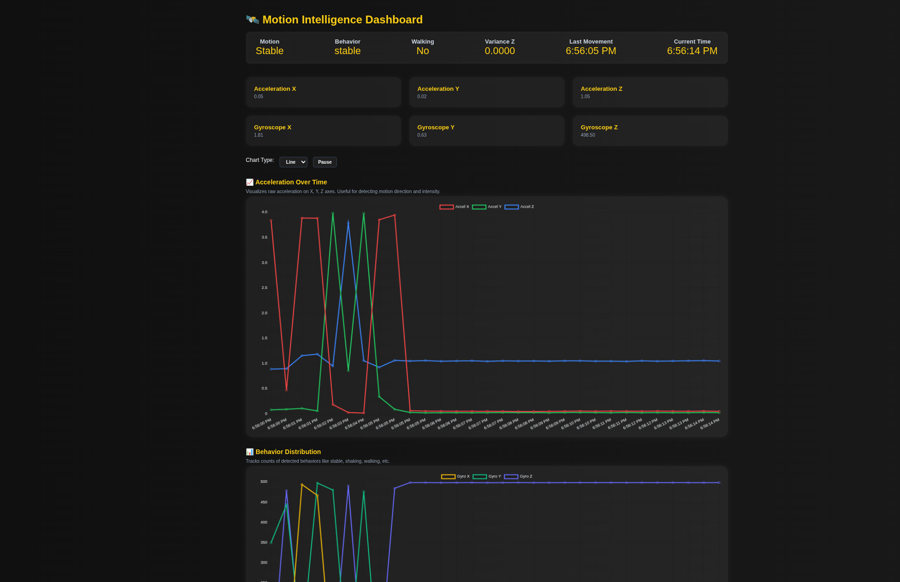
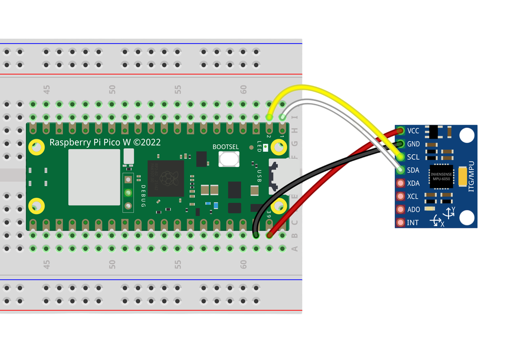

# Motion Analysis Dashboard with Raspberry Pi Pico WH and MPU6050

A lightweight, real-time motion tracking and analysis system built using the Raspberry Pi Pico WH and the MPU6050 accelerometer + gyroscope sensor. This project visualizes movement, detects behaviors like walking or shaking, and logs sensor data through a self-hosted, browser-accessible dashboard.

This project was created solely for learning purposes as part of the university course *Laboratories of Industrial Electronics*.

It serves as a functional prototype and starting point for future development. While the system works reliably for basic movement detection, it currently lacks advanced features such as:

* Numerical filtering 
* Machine learning-based behavior classification
* Enhanced connectivity (e.g., cloud sync)
* Professional-grade electronic design and protection circuits

These would be essential for use in more demanding or production-level applications.

## Features

**Real-Time Data Collection**: Sensor data is captured every 500 ms.

**Behavior Detection**: Automatically identifies motion types (e.g., walking, tilting, shaking) using dynamic thresholding and variance calculations.

**Modern Web UI**: Responsive web dashboard with live charts, motion status boxes, and readable logs.

**Standalone Operation**: The device creates its own Wi-Fi network (Access Point mode), requiring no internet connection.

**Data Logging**: All motion events and sensor readings are saved to a JSON file for later analysis.

**Customizable Detection**: Motion thresholds and behavior criteria are configurable in MicroPython code.

## Hardware Needed

1. **MPU-6050**
2. **Raspberry Pi Pico WH**

## Setup Instructions

1. Clone this repo and flash MicroPython firmware to your Raspberry Pi Pico WH.
2. Upload all project files using Thonny or any other software.
3. Power the device and connect to the PicoNetwork Wi-Fi.
4. Open your browser at http://192.168.4.1 to view the dashboard.

